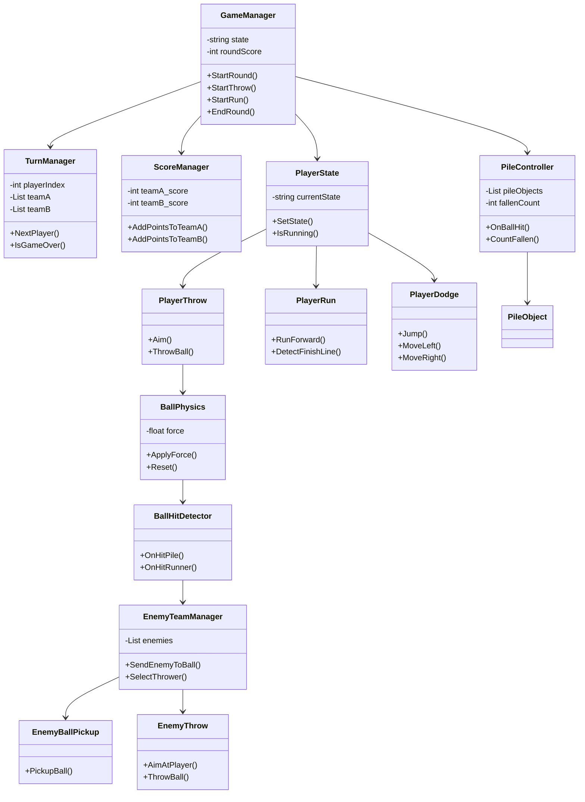

hit & run

המשחק מבוסס על משחק ילדות אמיתי בו הילדים מתחלקים לשתי קבוצות ומתחרים אחד בשני. כל ילד משתי הקבוצות נעמד מול כל שחקני היריבה כאשר מולם נמצאת ערימה של חפצים,על השחקן לזרוק את הכדור לעבר הערימה ולנסות להפיל כמה שיותר ואז לרוץ לנקודת הסיום כדי להרוויח את הנקודות כאשר כל שחקני היריבה רודפים אחריו.

click here to play the game:https://yousef-masarwa97.itch.io/hitrun

לרכיבים הרשמיים לחצו כאן:
https://github.com/Game-Dev-Course-ArielUNI/Hit-and-Run/wiki#hit--run

---

